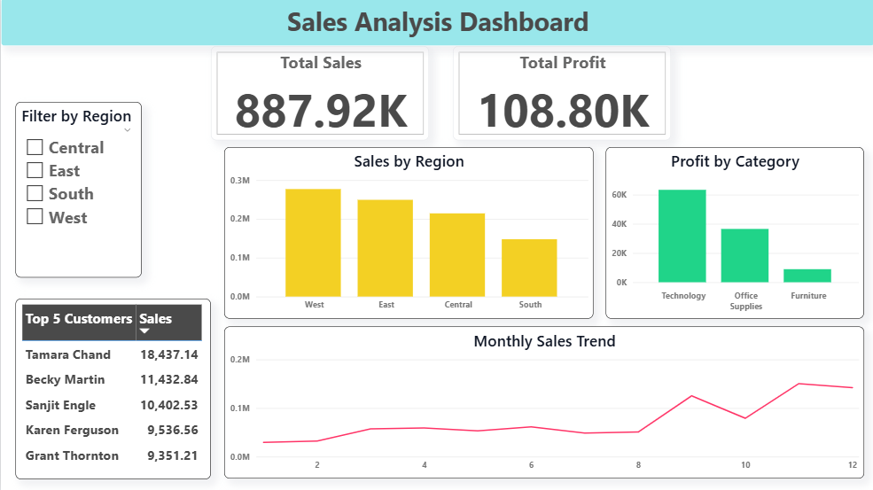

# Sales Analysis Dashboard Project

## 📌 Overview

This project focuses on analyzing sales data using Python, SQL, Power BI and Excel to extract meaningful business insights.

## 🛠 Tools Used

- Python (Pandas, NumPy)
- SQL (MySQL Workbench)
- Power BI
- Microsoft Excel

## 📊 Key Features

- Data cleaning and preprocessing using Python
- Sales analysis using SQL queries
- Interactive dashboard creation in Power BI
- Insights like top customers, regional performance, and monthly trends

## 📈 Insights

- Identified top-performing customers
- Analyzed sales trends over time
- Compared profit across categories and regions

## 📷 Dashboard Preview

## 🚀 Conclusion

This project demonstrates how raw data can be transformed into actionable insights using modern data analysis tools.
